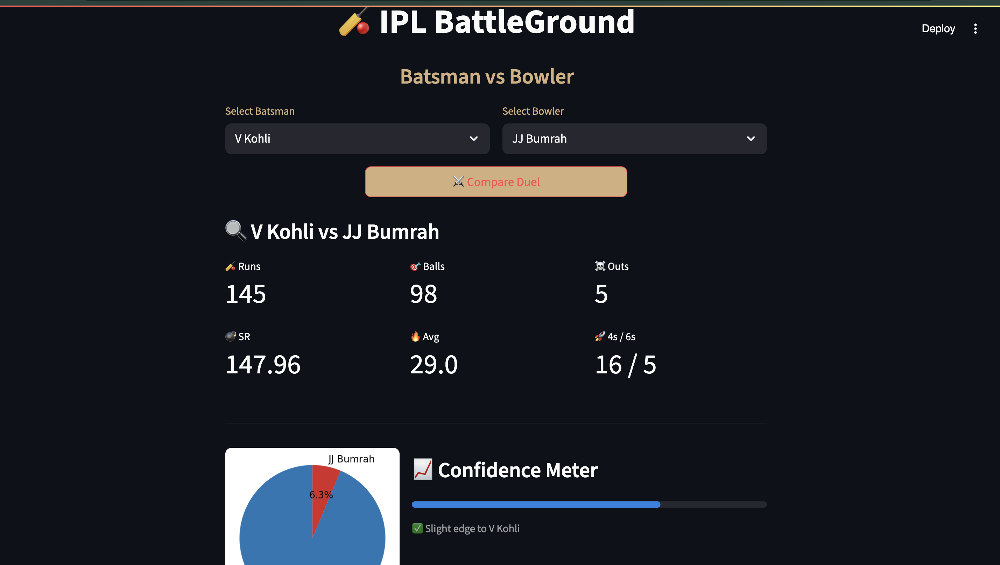

# 🏏 IPL BattleGround - Batsman vs Bowler Duel Analyzer

A Streamlit app to analyze IPL duels between batsmen and bowlers using historical ball-by-ball data.

## 📸 Preview


---

## 🚀 Features
- Select any batsman and bowler from IPL history
- See duel stats like:
  - Runs scored
  - Balls faced
  - Strike Rate
  - Average
  - 4s/6s count
  - Confidence Meter
  - Dominance Pie Chart
- Clean, responsive UI with Streamlit and matplotlib
  
---

## 📦 Tech Stack
- Python
- Streamlit
- Pandas
- Matplotlib
  
---
## 🛠️ How to Run Locally

``` bash
- git clone https://github.com/your-username/ipl-stats-compare.git
- cd ipl-stats-compare
- pip install -r requirements.txt
- streamlit run app.py
```
---

 ## Acknowledgements
- Kaggle
- Streamlit

 ## Acknowledgements
- Kaggle
- Streamlit 


